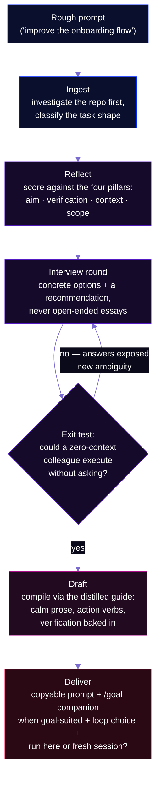
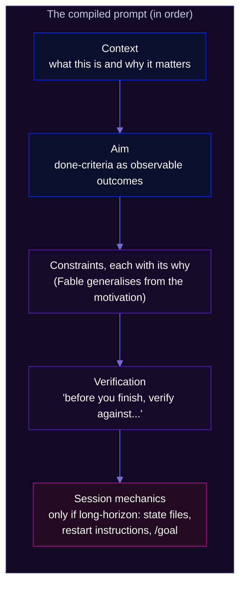

# fable-promptify

**The interview-first prompt compiler for Claude Fable 5 sessions.**


We have Fable 5 until the dreaded ~~June 22nd~~ July 7th, and I don't want to burn a single session of it on a half-formed prompt. fable-promptify takes a rough prompt ("improve the onboarding flow") and interviews you until the aim is crystal, then compiles it into a prompt with an observable goal, verification Fable can run without you, and the *why* behind every constraint. Happy building!

**Quick start:**

```bash
npx skills add yungbose/fable-promptify
```

```
/fable-promptify <your rough prompt>
```

<p align="center">
  
</p>

## Why this exists

Every serious Fable prompt had me re-deriving the same rules from three scattered sources: the Anthropic prompting docs, Thariq's launch video, and Lance Martin's piece on designing loops. So I distilled them once, into a reference the skill reads at draft time.

The launch video also names a trap I kept hitting: *"I might not actually know what I want."* Give Fable a vague prompt and it builds *an* interpretation — well enough that you never notice the aim was never yours. The fix from the video is "ask Claude to interview me before writing the spec"; this skill makes that automatic.

## How it works



### The four pillars

Every Fable prompt earns its autonomy when four things are crystal. The reflection phase scores the rough prompt against them; the interview only asks about what's missing.

| Pillar | Crystal when... |
|---|---|
| **Aim** | "Done" is an observable outcome, not an activity — "users can export a CSV of X", not "work on exports" |
| **Verification** | Fable can check its own work without you: tests, a rubric of checkable criteria, observable behaviour |
| **Context** | Every constraint carries its motivation — "this is an experiment, real chance we delete it in a month", not "keep it simple" |
| **Scope & ambition** | Boundaries are explicit (what NOT to touch), and the ambition level is stated (minimal fix vs go-beyond-the-basics) |

### What the compiled prompt looks like



The task shape decides how much of this you get. A quick bug fix compiles to 3–8 lines (aim + verification, nothing else). A long-horizon autonomous run adds state files (`tests.json`, `progress.txt`), fresh-context restart instructions, and a verifier-subagent pass. The right amount of prompt is the minimum the task needs — importing every best practice into every prompt is one of the failure modes the skill explicitly guards against.

## Goal-suited tasks get a second artifact: the /goal companion

Claude Code's [`/goal`](https://code.claude.com/docs/en/goal) turns a session into a goal-based loop: after every turn, a small fast evaluator model (Haiku by default) reads your condition plus the transcript and decides whether Claude is done — "not met" sends it back to work with the reason as steering. Two mechanics shape everything: the condition is capped at **4,000 characters**, and the evaluator **runs no tools** — it can only judge what Claude's own output has put in the transcript.

So when a task has deterministic exit criteria (tests pass, build exits 0, a score clears a threshold), fable-promptify compiles a **second artifact** alongside the prompt: a compact completion contract for the evaluator. Every criterion pairs a measurable end state with the check that proves it ("`npm test` exits 0 — run it and show the summary"), the constraints that matter, and a turn cap inside the text. The context and the *why* stay in the prompt — the goal carries only what the evaluator needs to answer yes/no.

Delivery is keyed to task shape:

| Task shape | Pattern | Why |
|---|---|---|
| Quick verifiable task | **Goal-only** — one `/goal` line carries task + check + cap | Setting a goal immediately starts a turn; no separate prompt needed |
| Feature build / long-horizon | **Spec file + compact goal** (the default) — compiled prompt saved as a handover file, goal says "implement the spec in `<file>` fully" + the contract | One paste; every turn including the first is goal-evaluated; the file survives context refreshes |
| Already mid-session | **Prompt-then-goal** — paste the prompt, set the goal once work is underway | Supported, but in a fresh session the spec-file pattern needs one paste and has no unevaluated first turn |

The one thing it never does is cram the compiled prompt into the goal argument: the 4,000-char cap forces lossy compression of exactly what makes a Fable prompt work (context-with-why), and the evaluator re-reads the condition every turn — it needs the contract, not the story.

Subjective outcomes (design taste, prose voice) are deliberately *not* goal-suited — a small evaluator model can't judge them. Those get a verifier subagent instead.

## Getting started

Install with the open skills CLI:

```bash
npx skills add yungbose/fable-promptify
```

Or copy it into your agent's skills directory by hand (`~/.claude/skills/` for Claude Code):

```bash
git clone https://github.com/yungbose/fable-promptify.git
cp -r fable-promptify/fable-promptify ~/.claude/skills/fable-promptify
```

Then, in any session:

```
/fable-promptify make the expenses dashboard better
```

It will investigate your repo, ask you what "better" means in concrete options, keep asking until the aim passes the exit test, and hand you a compiled prompt plus the choice: run it here, or paste it into a fresh Fable session.

## Built with its own discipline

The skill was created behind a staging contract (via [upskill](https://github.com/yungbose/upskill)) and gated by a RED/GREEN test before it was allowed onto disk. The test is preserved in `fable-promptify/tests/` as a permanent regression check.

**RED (no skill):** an agent asked to turn a deliberately vague one-liner into "the best possible Fable 5 prompt" produced a full, polished prompt in its first response. It decided — without asking — what "better" meant. Plausible, well-structured, and built entirely on a guessed aim.

**GREEN (with skill):** the same task produced an interview round instead: what's the biggest problem, what does success look like as an observable outcome, how ambitious should this be, and what's the *why* behind each constraint. Given answers, it correctly applied the exit test, declared the aim crystal, and compiled a prompt with three observable done-criteria, every constraint carrying its motivation, a baked-in self-check, and session setup advice.

| | Without the skill | With the skill |
|---|---|---|
| First response | Polished prompt on an invented aim | Interview round with options + recommendation |
| Constraint handling | None asked for | Elicited with the why, woven into the prompt |
| Verification | Generic ("run the tests") | Observable done-criteria + self-check instruction |
| Stopping | n/a | Applied the exit test; no padding rounds |

## Design decisions

### 1. Interview until crystal, not a fixed round count
The exit condition is a quality gate, not a question budget: *could a colleague with zero context execute from the current understanding without asking a single question?* One round if the rough prompt was nearly there; several if each answer exposes new ambiguity. The same test prevents the opposite failure — interviewing past clarity is annoyance, not rigour, so the skill stops the moment the test passes.

### 2. The deliverable is the prompt, never the execution
The skill never drifts into doing the task mid-flow. Refining and executing are different jobs with different context needs — the refined prompt usually belongs in a *fresh* session precisely because the current one has accumulated unrelated context. Execution is offered at the end as an explicit choice, not assumed.

### 3. Four pillars as the rubric, not a checklist of tips
The three source documents contain dozens of techniques. Most are situational. The reflection phase deliberately scores against only four things — aim, verification, context, scope & ambition — because those are the ones that decide whether Fable's autonomy works for you or against you. Everything else (XML tags, examples, prompt ordering) is drafting mechanics, applied at compile time from the reference guide without bothering the user.

### 4. Context, not constraints — enforced at interview time
"Keep it simple" copied verbatim into the output is a compile failure. When the user gives a bare constraint, the interview asks for the motivation behind it, and the compiled prompt carries the why ("this is an experiment; don't build anything painful to throw away"). Fable generalises from motivations — it catches things you didn't think to forbid. Bare rules don't generalise.

### 5. Calm prose, by rule
No CAPS, no "MUST", no "CRITICAL" in compiled prompts. Aggressive emphasis was a crutch for older models that undertriggered; Fable-class models are responsive enough that it causes overtriggering instead. This is a hard drafting rule precisely because it's counterintuitive — years of prompt-writing habit push the other way.

### 6. Investigate before asking
A question the repo can answer is a wasted interview round and an erosion of trust. The ingest phase reads the project's CLAUDE.md, relevant files, and recent commits first; the interview only asks what reflection flagged *and* the repo can't answer. "What test framework do you use?" is a Read, not a question.

### 7. The best practices live in one reference file
All three sources are distilled into `references/fable-prompting-guide.md`, and the skill reads it at draft time rather than working from memory. One file to update when Anthropic publishes new guidance; the skill's behaviour updates with it. The guide also carries per-task-shape sections (quick task / feature / long-horizon / research / writing) so right-sizing is data, not judgment.

### 8. Right-sized output over complete output
Every line of the compiled prompt must earn its place. A 10-line bug-fix prompt with long-horizon state-file boilerplate is worse than the rough original — it dilutes the signal Fable actually needs. Task-shape classification happens at ingest, and the draft phase only pulls the guide sections that shape needs.

### 9. The goal is a contract for the evaluator, not a compressed prompt
Prompt and goal are different artifacts for different readers. The prompt is read by Fable and carries context, motivation, and instructions at whatever length the task needs. The goal is re-read every turn by a small evaluator model that runs no tools, so it carries only transcript-verifiable criteria, constraints, and a turn cap — under 4,000 characters, with the count reported at delivery. This split follows the loop taxonomy in the Claude Code team's ["Designing Loops for Claude Code Agents"](https://x.com/ClaudeDevs/status/2074208949205881033): you hand the goal-based loop *the stop condition*, and deterministic criteria are what let the evaluator stop the loop at the earliest correct moment.

### 10. Improvement wiring from day one
The skill ships with the [upskill](https://github.com/yungbose/upskill) artifact set: `learnings.md` (read at every run start), `run-journal.md`, a domain-specific retrospective checklist, and a `tests/` folder seeded with the creation-gate test. If the operator keeps revising compiled prompts the same way, the retro captures it and the correction applies on the next run — the prompt compiler improves the same way the prompts do.

## Sources

The reference guide distils these documents (June–July 2026):

1. **[Anthropic prompting best practices](https://platform.claude.com/docs/en/build-with-claude/prompt-engineering/claude-prompting-best-practices)** — clarity and directness, context behind instructions, XML structure, calm-prompting for 4.6+ models, long-horizon state management, anti-overengineering and anti-test-gaming guidance, the self-check pattern.
2. **[Fable 5 launch video](https://x.com/ClaudeDevs/status/2064399512664526853)** (Thariq, [@trq212](https://x.com/trq212), Claude Code team) — the mindset shift from supervising to directing; thought partner / goals-with-verification / ambition; the interview-me pattern; context-not-constraints.
3. **["Designing loops with Fable 5"](https://x.com/RLanceMartin/status/2064397389189071163)** (Lance Martin, [@RLanceMartin](https://x.com/RLanceMartin), Anthropic) — design loops rather than steering; rubrics as environment feedback; verifier subagents over self-critique; the memory progression (fail → investigate → verify → distill → consult).
4. **["Fable is Mythos, and it is really good"](https://www.youtube.com/watch?v=7IewbRdaBWI)** (Theo, [@theo](https://x.com/theo), t3.gg) — field-tested lessons from heavy launch-week use: pre-empting Fable's strong priors with explicit convention deviations, continuous checkpointing against unforeseeable cutoffs, and granting verification capability (tools, throwaway harnesses), not just criteria. Adversarially reviewed before inclusion; the claims that didn't survive review were dropped.
5. **["Designing Loops for Claude Code Agents"](https://x.com/ClaudeDevs/status/2074208949205881033)** ([@delba_oliveira](https://x.com/delba_oliveira), Claude Code team, July 2026) — the four-loop taxonomy (turn-based / goal-based / time-based / proactive), what you hand off in each, and the token-budget rules: deterministic criteria, explicit turn caps, scripts for deterministic work, pilot before a large run.
6. **[Official `/goal` docs](https://code.claude.com/docs/en/goal)** (code.claude.com, fetched July 2026) — the mechanics the goal companion is drafted against: session-scoped stop check, Haiku-default evaluator that sees the condition + transcript but runs no tools, the 4,000-character condition cap, turn caps inside the condition text, and headless `claude -p "/goal ..."` runs.

## Pairs with upskill

fable-promptify front-loads clarity into a session; [upskill](https://github.com/yungbose/upskill) extracts learning out of it afterwards. Use both and a session is bracketed: compiled aim going in, compiled corrections coming out.

## Further reading

| File | Purpose |
|---|---|
| `fable-promptify/SKILL.md` | The full procedure (five phases, exit test, common mistakes) |
| `fable-promptify/references/fable-prompting-guide.md` | The distilled best-practice guide (four pillars, style rules, per-shape templates, anti-patterns) |
| `fable-promptify/references/retrospective-checklist.md` | Domain-specific retro checks (interview-first, constraint motivation, calm prose, right-sizing) |
| `fable-promptify/tests/interview-first.md` | The RED/GREEN creation-gate test |
| `fable-promptify/tests/goal-companion.md` | The RED/GREEN test for the /goal companion (transcript-verifiable criteria, pattern choice, char cap) |
